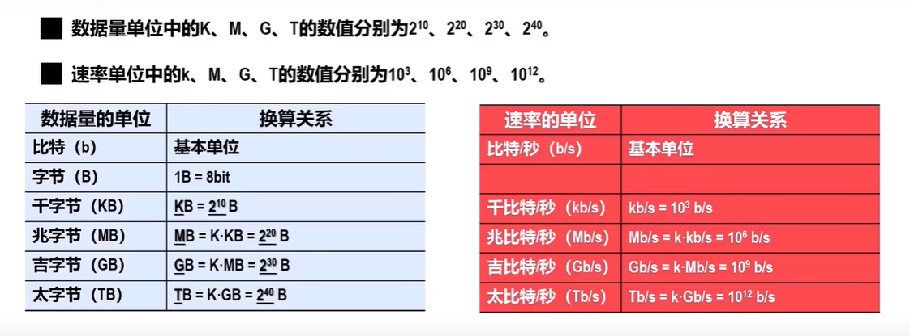
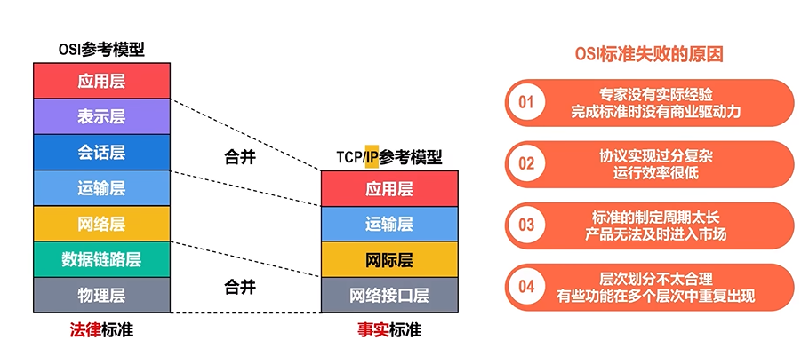
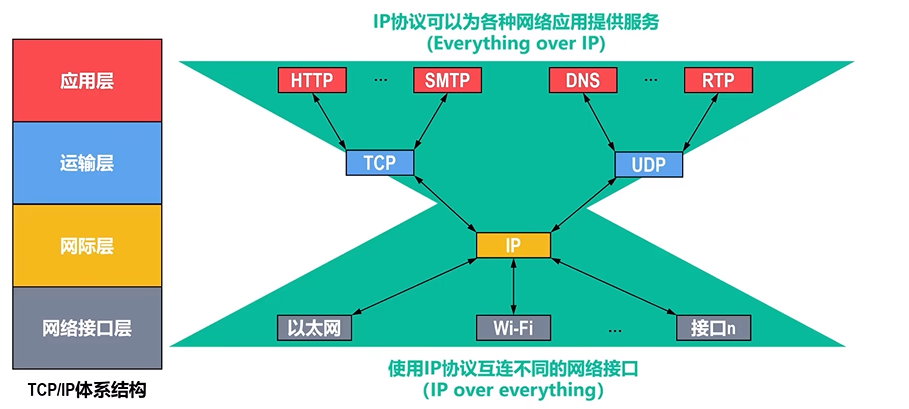
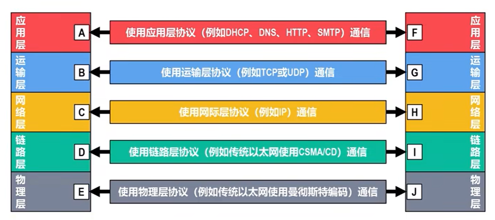

# system、 terminal
## 计算器网络
### 计算机覆盖范围
- WAN ： 广域网
- MAN ： 城域网
- LAN ： 广域网
- PAN ： 个域网

### TCP/IP协议
应用层（http，telnet，ftp, email, DNS等协议）-> 传输层（tcp,udp） -> 网络层（ip,icmp,ARP,PARP,BOOTP等协议）-> 网络接口层（设备驱动程序及接口卡）

### 网络协议体系结构
- 应用层： 解决通过应用进程的交互来实现特定网络应用的问题
- 运输层： 解决进程之间基于网络的通信问题
- 网络层： 解决数据包在多个网络之间传输和路由的问题
- 数据链路层： 解决数据包在一个网络或一段链路上传输的问题
- 物理层： 解决使用何种信号来表示0和1的问题

- 实体： 指任何可发送和接收信息的硬件或者软件进程
- 对等实体： 指通信双方相同层次中的实体
- 协议： 控制两个对等实体在“水平方向”经行“逻辑通信”的规则集合

### 导引型传输媒体和非导引型传输媒体
① 导向型传输媒体（固体媒体） 1.同轴电缆 2.双绞线 3.光纤

② 非导向型输出媒体（自由空间） 1.无线电波 2.微波 3.红外线 4.大气激光 5.可见光

### 客户端和服务器建立连接
**网址解析过程**
1. DNS解析，获取网站的ip地址
2. 浏览器需要和服务器建立连接(tcp/ip 协议族)三次握手
3. 向服务器发送请求(http协议)
4. 服务器处理请求，并返回相应(http协议)
5. 浏览器将响应渲染
6. 断开和服务器的连接(四次挥手)

**三次握手和四次挥手**
- 三次握手 - 建立连接
    1. 客户端向服务器发送连接请求 SYN
    2. 服务器收到连接请求，向客户端返回信息 SYN - ACK
    3. 客户端向服务器发送同意连接信息 ACK
- 四次挥手 断开连接
    1. 客户端向服务器发送请求，通过服务器数据发送完毕，请求断开连接 FIN
    2. 服务器向客户端返回数据，知道了 ACK
    3. 服务器向客户端返回数据，收到了，可以断开连接 FIN - ACK
    4. 客户端向服务器发送数据，可以断开了 ACK

**报文**

:robot: 浏览器向服务器直接通信是基于请求和响应

- 浏览器向服务器发送请求（request）
- 服务器向浏览器返回响应（response）
> HTTP协议就是对这个报文的格式进行规定

**响应状态码**
- 1xx 请求处理中
- 2xx 标识成功
- 3xx 请求重定向
- 4xx 客服端错误
- 5xx 服务器错误

## chrome devtools
ctrl+[ ]: 切换工具面板

元素：h可以快速切换显示和隐藏 ctrl+↑ ↓移动元素

monitor(function): 监听函数

monitorEvents(event): 监听事件

## Terminal command

### powershell
D: //进入D盘

cd .. //跳转上一层目录

dir: // 查看目录下的文件 类似于linux的ls

ipconfig: 查看 ip信息

help: 获取帮助

命令 /?（cd /?）：查询帮助信息和基本用法

### Linux
clear(cls)：清屏

ls(list):：查看列表 cmd用dir

cd：切换目录 cd.. 切换到上级目录

mkdir(md)：创建文件夹

rmdir(rd)：删除文件夹

del: 删除文件

cd rm rd mkdir touch del echo

del: 仅仅删除文件或者文件夹，不能递归删除子文件夹。 rd 或者 rmdir 专门用于递归的删除一个文件夹以及子文件夹的，不支持指定一个文件名。 rm -rf node_modules -r: 递归删除整个文件 -f: 强制删除不提示

md: //创建目录

rd: //删除目录

echo：在终端中输出变量或内容，（echo text > test.txt 将text内容通过重定向符号 > 将输出内容写入文件**)**

## GIT
GIT object
- BLOB 文件内容
- tree 目录结构，文件权限，文件名
- commit 上一个commit，对应快照，作者，提交信息
- refs HEAD、分支、tag

::: warning
**不可篡改** git和区块链的数据结构非常相识，两者都是基于哈希树和分布式
:::

### GIT文件标识
未跟踪 untrack ( <- git rm) -> 未修改unmodified ( <- git checkout)-> 已修改modified( <- git reset) -> 已暂存staged

A: 增加的文件

C：文件的一个新拷贝

D：删除的一个文件

M：文件的内容或者mode被修改 model file 修改 黄色

R：文件名被修改

T：文件的类型被修改

U：文件没有被合并（需要完成合并才能提交）unTracked 未跟踪 蓝色

X：未知状态

::: info
#HEAD 表示当前版本 HEAD^代表上一个版本
:::

### 常用命令
where git 查看git安装目录 Linux(which git)

git config --global --list 查看全局配置

git init 创建空仓库

git remote add origin https:github.git 本地仓库连接远程仓库

git pull origin master 拉取远程源master资源

git push -u origin master 推送远程的源 prigin 的 master 不是第一次不需要-u

git remote remove \<name\> 删除远程仓库的关联

git remote -v(verbose) 查看当前配置有那些远程仓库

git branch -avv 查看本地和远程分支的详细信息

git fetch --all 拉取所以远端分支

git restore . 用于丢弃工作区的修改或恢复文件的内容

**文件管理**

git rm \<file\> 把文件从工作区和暂存区同时删除

git rm --cached \<file\> 把文件从暂存区删除，但保留在当前工作区

git rm -r * 递归删除某个目录下的所有子目录和文件

## Vim
**模式： normal模式 > i 键切换到insert模式**
s
-动词：operator(操作符) -名词：Motion(动作) - Text object(文本对象)

**移动**
K：往上移动 J：往下移动 H：往左移动 L：往右移动

zc: 关闭代码折叠 --- zo打开代码折叠

%：匹配一对呈现的如() {} []

*：查找光标所单词的下一个 --- #查找光标所单词的上一个

w：跳到单词开头 b：跳到本单词或上一个单词开头 e：跳到本单词或下一个单词的结尾 ge：跳到上一个单词结尾

f{char}：光标跳转同行到下一个{char}位置 -- F{char}

t{char}：光标跳转到同行下一个char一个字符位置 -- T{char}*

; 反复上次的字符查找操作 -- , 反向查找上次的查找命令*

0 跳到行首 $跳到行尾 ^跳到非空行首

x：向后删除一个单词 --- X向前删除一个单词

r：替换当前单词

R：替换模式

c：删除并进入插入模式

s：删除光标再进去插入模式

=G：格式化文档 --- =3：格式化三行 --- =>>：向右缩进

J：合并行

~：切换大小写

.：重复上一次命令

**操作**

d(delete) 删除

dd：删除一行

c(change) 修改

cc：删除并进入写入模式

y(yank) 复制

yy：复制一行

v(visual) 选中并进入visual模式

p：复制一行

u：撤销操作

**动作**

i(inner)：i" -> "foo" iw -> foo i( -> (foo)

a(around)：i" -> "foo" iw -> foo i( -> (foo)

**insert模式：用于文本输入**

esc / ctrl+[：退出insert模式

**Visual模式：用于文本选择**

v: 进去选择模式

u：大小写转换 --- U

vi"：选中"xxx "内的内容

vip：选中一段内容

**Command模式：用于执行命令**

/{pattern}：向前搜索 ---- ?{pattern}：向后搜索

/ 进去查询模式

/进去搜索模式 输入查找字符回车

n匹配下一个结果 --- N上一个结果

进去正则替换模式

:：进入输入模式 :s/search/replace 当前行替换第一个 :s/search/replace/g g匹配当前行符合的所有 i区分大小写

:10,20s/search/replace 10-20表示10行到20行 :%s/search/replace %s表示当前文件全部匹配 :s/\<search\>/replace

gd: 转到定义

gh：鼠标hover效果

ctrl+]：查看定义

gt：切换标签页

ctrl+0：切换到文件面板

i：光标前插入

a：光标后插入

:wq：保存并退出

:q!：强制退出